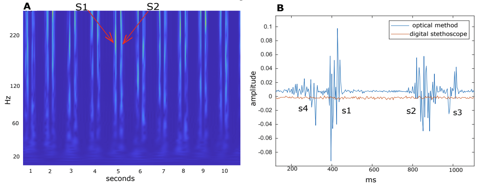

# Clinical experience obtained with the device so far

## Bench Testings
March 2020 - March 2021 : the device was in the development phase. This [paper](https://opg.optica.org/abstract.cfm?uri=isa-2020-IW3D.4) shows the device being tested for the purpose of checking that such a technology could acquire heart sounds with the best SNR. The paper describes the laser and ultrafast camera ability to acquire speckle patterns and the image processing necessary to extract sound from light. The object emitting sound was aluminium foil next to a speaker. This was the first proof of concept that allowed to acquire the best parameters for engineering the device and writing the necessary computer vision sofware. The [picture](proof-of-concept.png) shows the set up of what would then become the essential parts of the device: laser and ultrafast camera pointed towards a vibrating surface (surface that vibrates due to sound ex: wrist, chest, neck etc.).

## First Validation Trial on Humans
The device was tested on 3 subjects (myself and two of my collegues) to correctly set up parameters such as the degree of freedom of 
the angle for how much could the device be rotated in order to point int towards the desired position on the patient's body. Other tests included 
checking the frequency content obtained from different body locations, what ulytafast camera was most suited to acquire the best signal, what post ptocessing algorithm was best suited to process the data, what laser power/frequency was best suited. This is the [paper](https://ieeexplore.ieee.org/abstract/document/9541553) that shows the final results of these tests and below is the image of the heart sound obtained with the device on a subject vs what the stethoscope could achieve on the same subject 

## Bench Testings
April 2021 - Semptember 2021 : First validation trial. Ethcis approval were obtained from the University of Glasgow ethics department. In total, 13 
volunteers were recruited, although for the paper only the data from 10 volunteers was kept. The desciption of the results can be found in this 
[paper](https://pages.github.com/). 13 volunteers, chosen from the department of Engineering from the UoG were recruited. At the beginning of the trial, 1 volunteer was diagnosed with a heart condition while 14 of the volunteers considered themselves as healthy, as they never reeived a diagnosis or had heart related problems that warranted a visit to the hospital. The volunteers were between 20 and 40 years of age, both males and females. 
The volunteers were asked to sit in a chair and brathe normally while the laser was pointed at the base of their neck (chosen location for acquisition after the previous development phase tests). Despite the laser power only being 0.04 mW, so eye safe, the volunteers were given the option to wear eye
protective goggles acquired from the leading indutry vendor ThorLabs. The goggles were certified to be in good condition from engineerign experts. The goggles were made to block the laser frequency that was used by the device. Around 5 minutes of data was acquired from the volunteers on two different occasion, so the volunteers had to come during two different occasions. There was no required timelaspe between the two events. They could come in whenever they gave availability during a week. The laser power was very low so it was not only eye safe, but it also did not burn the skin. The volunteers were asked if they had experienced any unconfortableness during or afetr the trial but none of them reported any problems. The volunteers had to sign a document where they agreed to take part on the trial and agree that their data would be used in a research paper but that it would be anonymized. After the data processing step of the data collected, it was found that 1 vilunteer had a severe heart condition that they werent aware of. The volunteer went ahead to see a cardiologist that confirmed the diagnosis picked up by the device. The volunteer displayed no other symptoms. The diagnosis of all the other volunteers was consistent with theor previous status.

